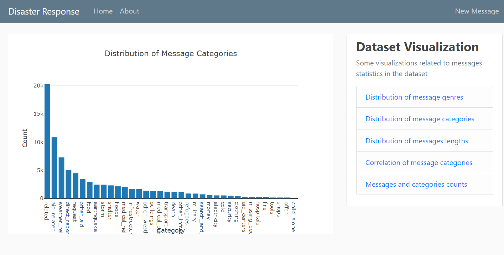
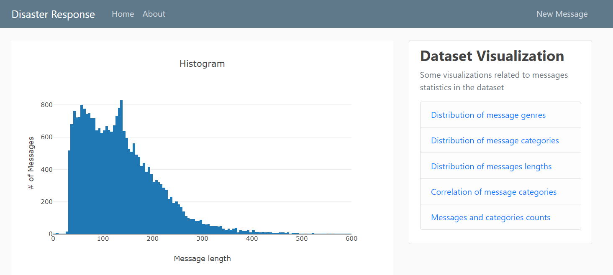
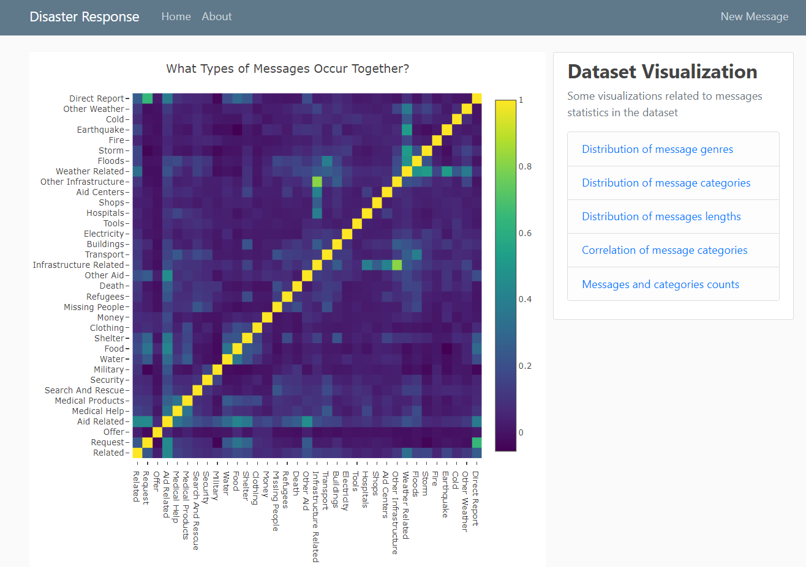
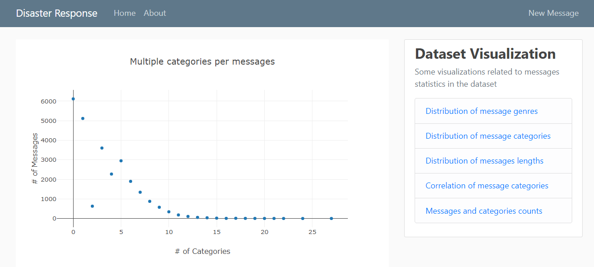
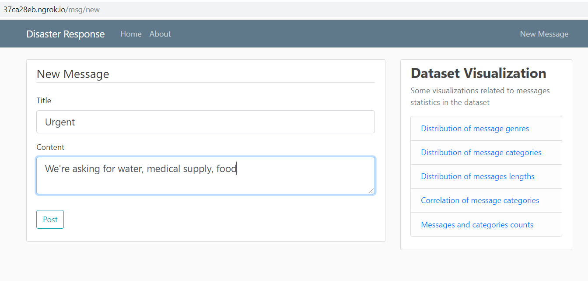
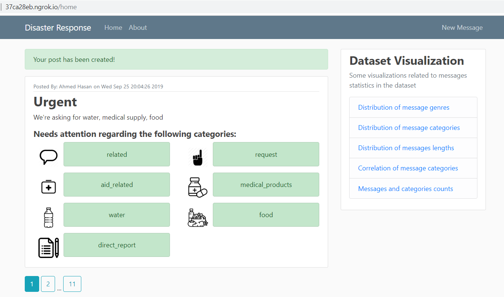

# Disaster Response App

## Table of Contents
- [Project Overview](#overview)
- [Project Components](#components)
  - [ETL Pipeline](#etl_pipeline)
  - [ML Pipeline](#ml_pipeline)
  - [Flask Web App](#flask)
  	- [Dataset Visualization](#visual)
  	- [Message categorization](#category)

## Introduction
Following a disaster, different organizations will try to respond to different problems of the disaster. Some will take care about water, other will take care about blocked roads and another will take care about medical supplies. So it is quite important to filter out a relevant message for a particular organization quickly and effectively from thousands of communications which happed either via social media or directly to disaster relief organizations.    
Figure Eight has created a dataset that contains about 30,000 messages drawn from events including an earthquake in Haiti in 2010, an earthquake in Chile in 2010, floods in Pakistan in 2010, super-storm Sandy in the U.S.A. in 2012, and news articles spanning a large number of years and 100s of different disasters. The data has been encoded with 36 different categories related to disaster response and has been stripped of messages with sensitive information in their entirety.   
This web app uses a supervised machine learning model to classify new messages to 36 different categories. This web app also extract data from this dataset to provide data visualizations. ML is critical in helping different organizations to understand which messages are relevant to them and which message to prioritize.  We want to investigate new trends and new way of building machine learning models that can help us respond to future disasters.   
- [Back to Table of Content](#index)

## 2. Project Components

There are three components of this project:

### 2.1. ETL Pipeline

File _data/process_data.py_ contains data cleaning pipeline that:

- Loads the `messages` and `categories` dataset
- Merges the two datasets
- Cleans the data
- Stores it in a **SQLite database**

### 2.2. ML Pipeline

File _models/train_classifier.py_ contains machine learning pipeline that:

- Loads data from the **SQLite database**
- Splits the data into training and testing sets
- Builds a text processing and machine learning pipeline
- Trains and tunes a model using GridSearchCV
- Outputs result on the test set
- Exports the final model as a pickle file

### 2.3. Flask Web App
The Flask web app serves two purposes:

- Dataset Visualization
- Message categorization

#### 2.3.1. Data Visualization
The web app provides the following visualizations related to dataset:

**_Distribution of message genres_**

**_Distribution of message genres_**

**_Distribution of messages lengths_**

**_Correlation of message categories_**

**_Messages and categories counts_**

Running [this command](#com) **from app directory** will start the web app where users can enter their query, i.e., a request message sent during a natural disaster, e.g. _"We're asking for water, medical supply, food"_.

**_Screenshot 1_**

What the app will do is that it will classify the text message into categories so that appropriate relief agency can be reached out for help.

**_Screenshot 2_**

