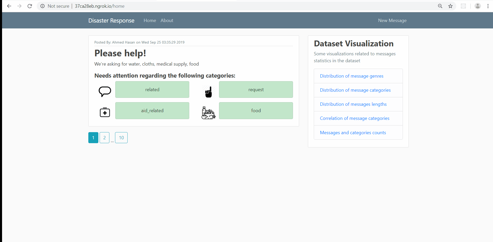

# Disaster Response App

## Table of Contents
- [Project Overview](#overview)

## Introduction
Following a disaster, different organizations will try to respond to different problems of the disaster. Some will take care about water, other will take care about blocked roads and another will take care about medical supplies. So it is quite important to filter out a relevant message for a particular organization quickly and effectively from thousands of communications which happed either via social media or directly to disaster relief organizations.    
Figure Eight has created a dataset that contains about 30,000 messages drawn from events including an earthquake in Haiti in 2010, an earthquake in Chile in 2010, floods in Pakistan in 2010, super-storm Sandy in the U.S.A. in 2012, and news articles spanning a large number of years and 100s of different disasters. The data has been encoded with 36 different categories related to disaster response and has been stripped of messages with sensitive information in their entirety.   
This web uses a supervised machine learning model to classify new messages to 36 different categories. This web app also extract data from this dataset to provide data visualizations. ML is critical in helping different organizations to understand which messages are relevant to them and which message to prioritize.  We want to investigate new trends and new way of building machine learning models that can help us respond to future disasters.   

 [Back to Table of Content](#index)

