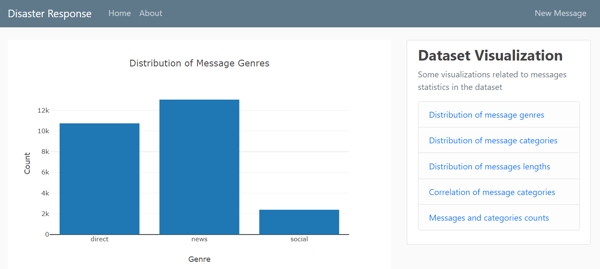
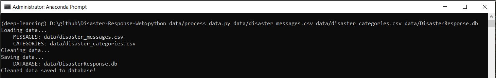
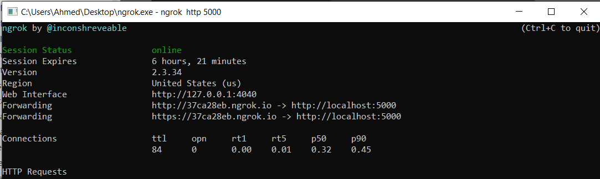
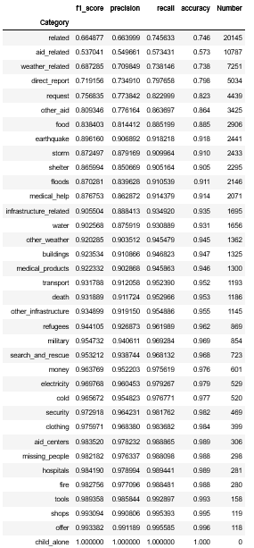

# Disaster Response App

<a id='index'></a>
## Table of Contents
- [Project Overview](#overview)
- [Project Components](#components)
  - [ETL Pipeline](#etl_pipeline)
  - [ML Pipeline](#ml_pipeline)
  - [Flask Web App](#flask)
  	- [Dataset Visualization](#visual)
  	- [Message Categorization](#category)
- [Usage Instructions](#run)
  - [Data Cleaning](#cleaning)
  - [Training Classifier](#training)
  - [Starting the Web App](#starting)
  	- [Running in localhost](#local)
  	- [ngrok Deployment](#ngrok)
- [Conclusion](#conclusion)
- [Software Requirements](#sw)
- [Files](#files)
- [Credits and Acknowledgements](#credits)


<a id='video'></a>
**_Video Demo of the deployed App_**

<hr/> 

[Back to Table of Content](#index)


<a id='overview'></a>
## Project Overview
Following a disaster, different organizations will try to respond to different problems of the disaster. Some will take care about water, other will take care about blocked roads and another will take care about medical supplies. So it is quite important to filter out a relevant message for a particular organization quickly and effectively from thousands of communications which happen either via social media or directly to disaster relief organizations. <br/> <br/>
Figure Eight has created a dataset that contains about 30,000 messages drawn from events including an earthquake in Haiti in 2010, an earthquake in Chile in 2010, floods in Pakistan in 2010, super-storm Sandy in the U.S.A. in 2012, and news articles spanning a large number of years and 100s of different disasters. The data has been encoded with 36 different categories related to disaster response and has been stripped of messages with sensitive information in their entirety.<br/> <br/>
This web app uses a supervised machine learning model to classify new messages to 36 different categories. This web app also extract data from this dataset to provide data visualizations. ML is critical in helping different organizations to understand which messages are relevant to them and which message to prioritize.  We want to investigate new trends and new way of building machine learning models that can help us respond to future disasters.  <br/>
<hr/> 

[Back to Table of Content](#index)

<a id='components'></a>
## 2. Project Components

There are three components of this project:

<a id='etl_pipeline'></a>
### 2.1. ETL Pipeline

File _data/process_data.py_ contains data cleaning pipeline that:

- Loads the `messages` and `categories` dataset
- Merges the two datasets
- Cleans the data
- Stores it in a SQLite database
<hr/> 

[Back to Table of Content](#index)

<a id='ml_pipeline'></a>
### 2.2. ML Pipeline

File _models/train_classifier.py_ contains machine learning pipeline that:

- Loads data from the SQLite database
- Splits the data into training and testing sets
- Builds a text processing and machine learning pipeline
- Trains and tunes a model using GridSearchCV
- Outputs result on the test set
- Exports the final model as a pickle file
<hr/> 

[Back to Table of Content](#index)

<a id='flask'></a>
### 2.3. Flask Web App
The Flask web app serves two purposes:

- Dataset Visualization
- Message categorization

<a id='visual'></a>
#### 2.3.1. Data Visualization
The web app provides the following visualizations related to dataset:

**_Screenshot: Distribution of message genres_**


<a id='imbalance'></a>
**_Screenshot: Distribution of message categories_**


**_Screenshot: Distribution of messages lengths_**


**_Screenshot: Correlation of message categories_**


**_Screenshot: Messages and categories counts_**


<hr/> 

[Back to Table of Content](#index)

<a id='category'></a>
#### 2.3.2. Message  Categoriztion
The web app lets an user enter an emergency message during a natural disaster, e.g. _"We're asking for water, medical supply, food"_.

**_Screenshot: New Message_**


After submitting the message, the web app will classify the message into categories so that appropriate relief agency can be reached out for help.

**_Screenshot: Message Categorization_**


<hr/> 

[Back to Table of Content](#index)

<a id='run'></a>

## 3. Usage Instructions

There are three steps to get up and runnning with the web app if you want to start from ETL process.

<a id='cleaning'></a>

### 3.1. Data Cleaning

Go to the project directory and the run the following command:

```
python data/process_data.py data/disaster_messages.csv data/disaster_categories.csv data/DisasterResponse.db
```

The first two arguments are input data and the third argument is the SQLite Database in which we want to save the cleaned data. The ETL pipeline is in _process_data.py_.

**_Screenshot: Data Claening_**


<hr/> 

[Back to Table of Content](#index)

<a id='training'></a>

### 3.2. Training Classifier

After the data cleaning process, run this command from the project directory:

```
python models/train_classifier.py data/DisasterResponse.db models/model.pkl
```

This will use cleaned data to train the model, improve the model with grid search and saved the model to a pickle file (_model.pkl_).
<hr/> 

[Back to Table of Content](#index)

<a id='starting'></a>

### 3.3. Starting the web app

<a id='local'></a>
#### 3.3.1. Running in localhost

Now that we have cleaned the data and trained our model. Now it's time to see the prediction in a user friendly way.

Go the app directory and run the following command:

<a id='com'></a>

```
python disaster_prediction.py
```

This will start the web app and will direct you to a URL (_http://localhost:5000_) where you can enter messages and get classification results for it.

<a id='ngrok'></a>
#### 3.3.2. ngrok Deployment

To access our local running web app from a public endpoint such as Internet, we have used _ngrok_ which is a multiplatform tunnelling, reverse proxy software. After running the _ngrok_ program, we enter the command:

```
ngrok http 5000
``` 

This will create a temporary URL _(http://37ca28eb.ngrok.io)_ via which we can access our web app running in our local computer from other computers. See [video demo](#video).

**_Screenshot: ngrok reverse tunnelling_**


<hr/> 

[Back to Table of Content](#index)

<a id='conclusion'></a>

## 4. Conclusion

As we can see from the [distribution of messages categories](#imbalance), the dataset is highly imbalanced. It gives a very interesting evaluation results as given below:

**_Screenshot: Evaluation Matrix_**



 It is evident that some of the highly represented categories have low evaluation scores while some of the less represented categories have very high scores. Since there are very few 1s in these less represented categories and so their metrics are still high even if they are all classified as 0s. As a result, it's important to not be too influenced by these values. It seems reasonable to seek to improve the performance of the original "lowest" performing categories.Also, some of the messages in the dataset seemed mislabelled.  So, in order to overcome these limitations, we need to take more examples for the less represented categories and need to do some manual clean-up of some mislabelled messages. Also, we have to use micro-averaging or weighted-averaging in our evaluation rather than macro-averaging.


<a id='sw'></a>

## 5. Software Requirements
This project uses **Python 3.6.6** and the necessary libraries are mentioned in _requirements.txt_.

<a id='files'></a>

## 6. Files
<pre>
+
|   README.md 					# Readme file
|   requirements.txt			# Required packages
|   
+---app
|   |   disaster_response.py	# Flask file that runs the app
|   |   forms.py				# Forms used in the app
|   |   site.db					# database to save user's messages
|   |   
|   +---static
|   |   |   main.css    		# main stylesheet
|   |   |   
|   |   \---msg_pics
|   |           msg_pics.zip	# image folder used in the app
|   |           
|   \---templates
|           about.html			# about page
|           create_msg.html		# new message page
|           graph1.html			# graph1 page
|           graph2.html			# graph2 page
|           graph3.html			# graph3 page
|           graph4.html			# graph4 page
|           graph5.html			# graph5 page
|           home.html			# home page
|           layout.html			# layout page
|           msg.html			# message page
|           
+---data
|       DisasterResponse.db  	# cleaned database
|       disaster_categories.csv	# given categories dataset
|       disaster_messages.csv	# given messages dataset
|       process_data.py			# performs ELT pipeline
|       
+---gif
|       Images folder used in Readme.md
|       
\---models
        train_classifier.py		# performs classification task
</pre>

<a id='credits'></a>

## 7. Credits and Acknowledgements

The web app is designed by following [Flask tutorials](https://www.youtube.com/playlist?list=PL-osiE80TeTs4UjLw5MM6OjgkjFeUxCYH) by Corey Schafer.

This github page is inspired by [this page](https://github.com/sanjeevai/disaster-response-pipeline).